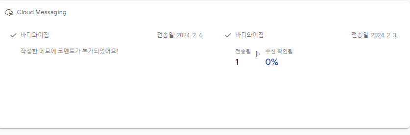

# bodyYgymISO

# 개발환경

# 데이터 구조 

## Authentication
    - 사용자 고유 ID
    - 사용자 ID
    - 사용자 비밀번호

## Realtime Database
- Chats
    - 고유 ID
    - 작성자 닉네임
    - 고유 ID
    - 채팅방 이름
    - 비밀번호
    - 개설된 시간
- Memos
    - 날짜
        - 메모 고유 ID
        - 이미지 URL
        - 메모 코멘트
        - 메모 내용
        - 공유 T/F
        - 사용자 닉네임
- Users
    - 고유 id
        - 사용자 닉네임 
- comments
    - 게시글 고유 ID
        - 작성자 닉네임
        - 댓글 고유 ID
        - 댓글 내용
        - 작성 시간
        - 유저 고유 ID
- posts
    - 게시글 고유 ID
        - 게시글 내용
        - 이미지 URL
        - 게시글 고유 ID
        - 게시글 제목
        - 작성자 닉네임
- report 
    - 게시글 고유 ID
        - 신고자 닉네임
        - 게시글 제목
        - 신고 고유 ID
        - 신고 사유

# 개발 과정 및 코드 리뷰

https://vitamin3000.tistory.com/category/IOS%20%EC%95%B1%20%EA%B0%9C%EB%B0%9C

# 앱 스토어 업로드

# 메시지 알림

